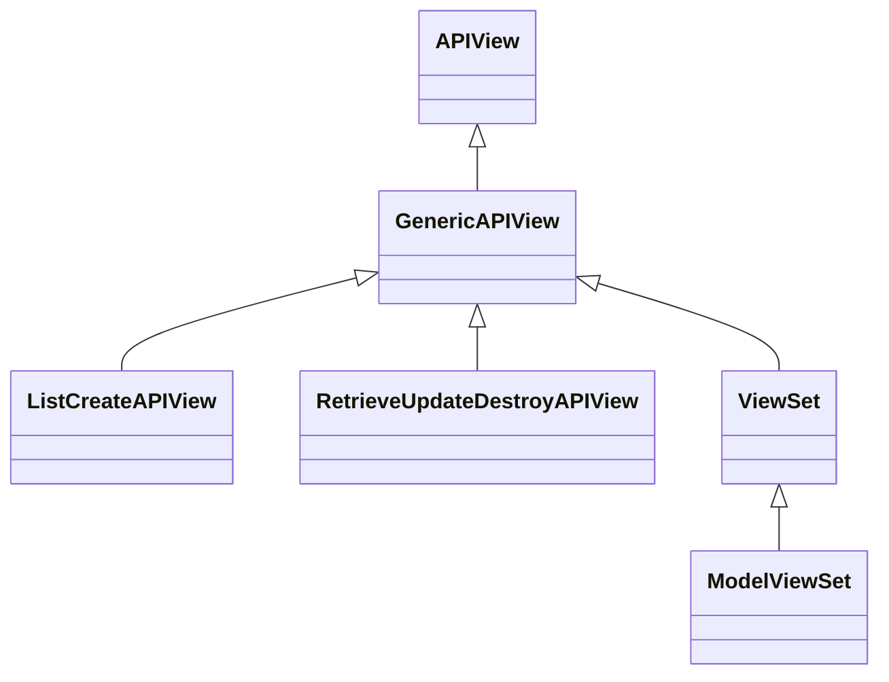

### Guia Essencial 20/80: CBVs e ViewSets no Django REST Framework

Vou focar nos 20% mais importantes das Class-Based Views (CBVs) e ViewSets que resolvem 80% dos problemas com APIs DRF.

---

#### **1. Hierarquia de Views no DRF**


---

#### **2. CBVs Essenciais (Generic Views)**

**a) ListCreateAPIView (GET lista + POST)**
```python
from rest_framework import generics

class ProdutoList(generics.ListCreateAPIView):
    queryset = Produto.objects.all()
    serializer_class = ProdutoSerializer
    permission_classes = [IsAuthenticated]
    
    # Filtro customizado
    def get_queryset(self):
        return Produto.objects.filter(usuario=self.request.user)
    
    # Pré-processamento antes de salvar
    def perform_create(self, serializer):
        serializer.save(usuario=self.request.user)
```

**b) RetrieveUpdateDestroyAPIView (GET/PUT/PATCH/DELETE detalhe)**
```python
class ProdutoDetail(generics.RetrieveUpdateDestroyAPIView):
    queryset = Produto.objects.all()
    serializer_class = ProdutoSerializer
    lookup_field = 'slug'  # Usa slug em vez de ID
    
    def perform_update(self, serializer):
        instance = serializer.save()
        logger.info(f"Produto {instance.id} atualizado")
```

**Parâmetros comuns:**
- `queryset`: Conjunto de dados base
- `serializer_class`: Serializer para conversão
- `permission_classes`: Controle de acesso
- `lookup_field`: Campo para busca (padrão: `pk`)
- `lookup_url_kwarg`: Parâmetro na URL (padrão: mesmo de `lookup_field`)

---

#### **3. ViewSets + Routers (Poder máximo com mínimo código)**

**a) ModelViewSet (CRUD completo)**
```python
from rest_framework import viewsets

class ProdutoViewSet(viewsets.ModelViewSet):
    serializer_class = ProdutoSerializer
    permission_classes = [IsOwnerOrReadOnly]
    
    def get_queryset(self):
        # Filtra por query params
        queryset = Produto.objects.all()
        categoria = self.request.query_params.get('categoria')
        if categoria:
            queryset = queryset.filter(categoria__nome=categoria)
        return queryset
    
    # Ação customizada
    @action(detail=True, methods=['post'])
    def ativar(self, request, pk=None):
        produto = self.get_object()
        produto.ativo = True
        produto.save()
        return Response({'status': 'produto ativado'})
```

**b) Configuração de Rotas**
```python
# urls.py
from rest_framework.routers import DefaultRouter

router = DefaultRouter()
router.register(r'produtos', ProdutoViewSet, basename='produto')

urlpatterns = [
    path('', include(router.urls)),
]
```

**URLs geradas automaticamente:**
- `GET /produtos/` → Lista
- `POST /produtos/` → Criação
- `GET /produtos/{pk}/` → Detalhe
- `PUT /produtos/{pk}/` → Atualização total
- `PATCH /produtos/{pk}/` → Atualização parcial
- `DELETE /produtos/{pk}/` → Exclusão
- `POST /produtos/{pk}/ativar/` → Ação customizada

---

#### **4. Personalização Avançada**

**a) Controle por método HTTP**
```python
class ProdutoViewSet(viewsets.ModelViewSet):
    # ...
    
    def create(self, request, *args, **kwargs):
        # Personaliza criação
        if not request.user.pode_criar_produto:
            return Response({'erro': 'Limite excedido'}, status=403)
        return super().create(request, *args, **kwargs)
    
    def destroy(self, request, *args, **kwargs):
        # Personaliza exclusão
        instance = self.get_object()
        if instance.vendido:
            return Response({'erro': 'Produto já vendido'}, status=400)
        return super().destroy(request, *args, **kwargs)
```

**b) Serializers diferentes por ação**
```python
class ProdutoViewSet(viewsets.ModelViewSet):
    def get_serializer_class(self):
        if self.action == 'list':
            return ProdutoListSerializer
        return ProdutoDetailSerializer
```

**c) Paginação customizada**
```python
class CustomPagination(PageNumberPagination):
    page_size = 10
    page_size_query_param = 'page_size'
    max_page_size = 100

class ProdutoViewSet(viewsets.ModelViewSet):
    pagination_class = CustomPagination
    # ...
```

---

#### **5. Mixins para Controle Fino**

Use quando precisar de combinações específicas:

```python
from rest_framework import mixins, viewsets

class ProdutoViewSet(
    mixins.CreateModelMixin,
    mixins.ListModelMixin,
    mixins.RetrieveModelMixin,
    viewsets.GenericViewSet
):
    # Suporta apenas: 
    # POST /produtos/
    # GET /produtos/
    # GET /produtos/{id}/
    queryset = Produto.objects.all()
    serializer_class = ProdutoSerializer
```

**Misturas disponíveis:**
- `CreateModelMixin`: POST (criação)
- `ListModelMixin`: GET lista
- `RetrieveModelMixin`: GET detalhe
- `UpdateModelMixin`: PUT/PATCH
- `DestroyModelMixin`: DELETE

---

#### **6. Ações Customizadas (@action)**

```python
class ProdutoViewSet(viewsets.ModelViewSet):
    # ...
    
    @action(
        detail=False,  # Ação na lista (não em objeto específico)
        methods=['get'],
        url_path='relatorio',
        url_name='produto-relatorio'
    )
    def gerar_relatorio(self, request):
        produtos = self.get_queryset()
        data = gerar_relatorio_pdf(produtos)
        return Response(data, headers={
            'Content-Type': 'application/pdf',
            'Content-Disposition': 'attachment; filename="relatorio.pdf"'
        })
    
    @action(
        detail=True,
        methods=['post'],
        permission_classes=[IsAdminUser]
    )
    def duplicar(self, request, pk=None):
        original = self.get_object()
        copia = Produto.objects.create(
            nome=f"Cópia de {original.nome}",
            preco=original.preco
        )
        serializer = self.get_serializer(copia)
        return Response(serializer.data, status=201)
```

**Parâmetros do `@action`:**
- `detail`: True para ação em objeto, False para coleção
- `methods`: Métodos HTTP permitidos (['get'], ['post'], etc.)
- `url_path`: Caminho na URL (padrão: nome do método)
- `url_name`: Nome da URL (para reversão)
- `permission_classes`: Permissões específicas

---

#### **7. Fluxo de Processamento (Ordem de Execução)**

Para uma requisição `POST /produtos/`:
1. `dispatch()` (gerenciamento geral)
2. `create()` (método da view)
3. `get_serializer()` (obtenção do serializer)
4. `get_serializer_context()` (contexto adicional)
5. `perform_create()` (lógica de persistência)
6. `serializer.save()` (salva o objeto)
7. `get_success_headers()` (cabeçalhos da resposta)

**Ponto de personalização chave:**
```python
def perform_create(self, serializer):
    # Lógica antes/depois da criação
    serializer.save(usuario=self.request.user)
```

---

#### **8. Boas Práticas e Padrões 20/80**

1. **Use ModelViewSet para CRUDs padrão** (resolve 90% dos casos)
2. **Sobrescreva `get_queryset()`** para:
   - Filtragem baseada no usuário
   - Filtros dinâmicos via query params
3. **Sobrescreva `perform_create`/`perform_update`** para:
   - Adicionar dados automaticamente (usuário, timestamps)
   - Pré-processamento antes de salvar
4. **Use `@action` para endpoints customizados** em vez de criar views separadas
5. **Para lógica complexa**:
   - Sobrescreva métodos específicos (`create`, `update`)
   - Use serviços externos (mantenha a view enxuta)
6. **Controle de permissões**:
   - `permission_classes` global no viewset
   - Sobrescreva `get_permissions()` para ações específicas
   ```python
   def get_permissions(self):
       if self.action == 'destroy':
           return [IsAdminUser()]
       return [IsAuthenticated()]
   ```

---

### **Checklist 20/80 para CBVs e ViewSets**

1. **View básica:** Use `APIView` para endpoints não-CRUD
2. **CRUD simples:** Use `ListCreateAPIView` + `RetrieveUpdateDestroyAPIView`
3. **CRUD completo:** Use `ModelViewSet` + `DefaultRouter`
4. **Personalização:**
   - `get_queryset()` para filtragem
   - `perform_create()`/`perform_update()` para lógica pré-salvamento
   - `@action` para endpoints customizados
5. **Controle de acesso:** `permission_classes` + `get_permissions()`
6. **Serialização múltipla:** `get_serializer_class()` para diferentes ações
7. **Ponto de extensão:** Sobrescreva métodos específicos (`create`, `update`, etc.)

Dominando esses 20%, você resolve 80% dos desafios com views DRF! 🚀